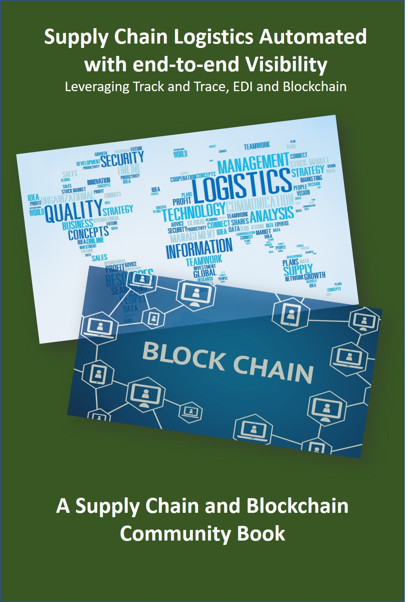

# Supply Chain Logistics and Blockchain Book
Open Source Book project delivering a deep understanding on how the Supply Chain can be enhanced by the adoption of BlockChain technology
* If you wish to contribute to this project please email <kevin@erpgenie.com> with your request.
* Focus in on Supply Chain Logistics and Procurement

This book is licensed under a <a rel="license" href="http://creativecommons.org/licenses/by-nc-nd/4.0/">Creative Commons Attribution-NonCommercial-NoDerivatives 4.0 International License</a>.